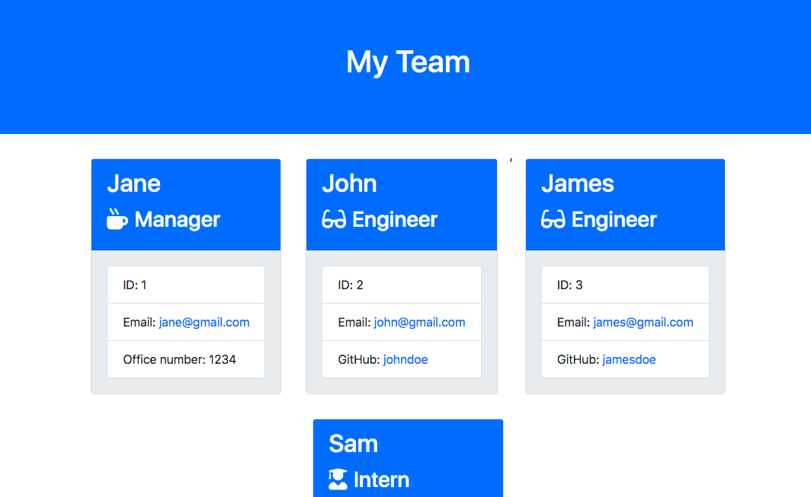
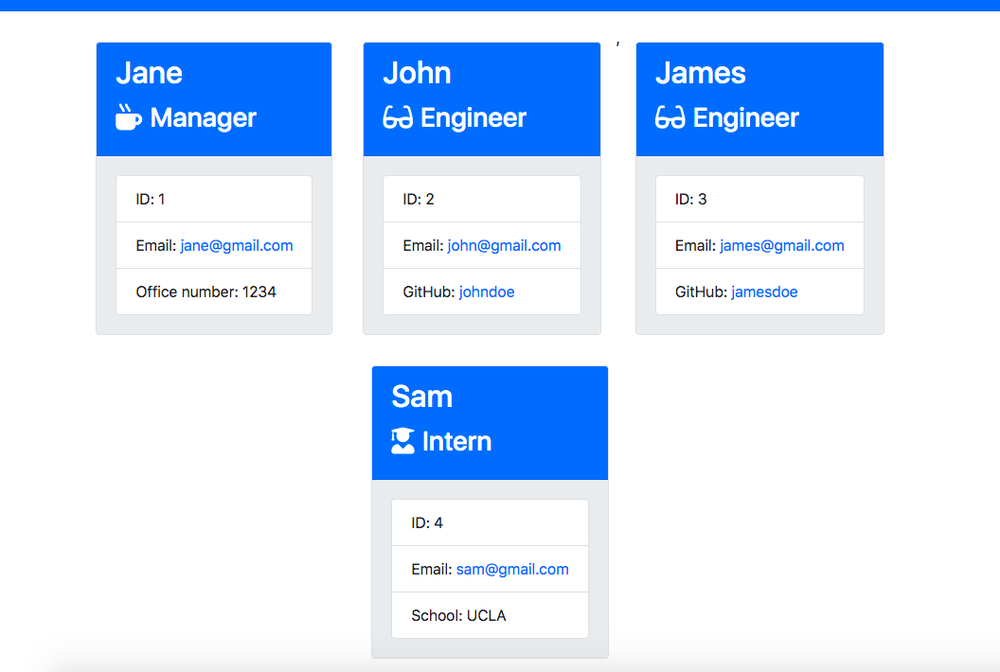
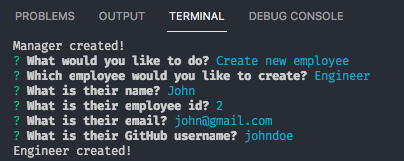
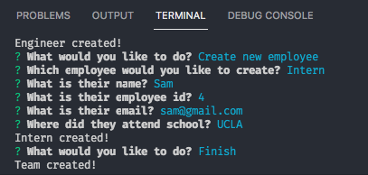
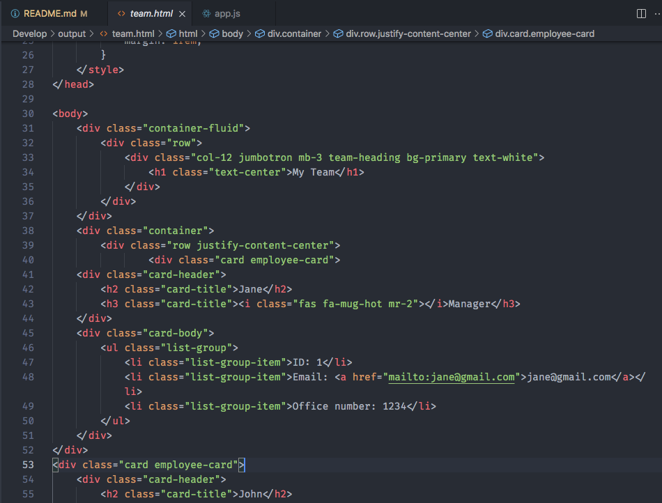

# EmployeeSummaryInfo
This is an employee team generator command line application. The app will prompt the user to input information about the team manager and the team members. When the user finishes building the team, the app will create an HTML file, team.html, that displays a team roster based on the information provided by the user.

## Screenshot(s)
Employee team webpage example

Demo 

 

Output team.html file example 
